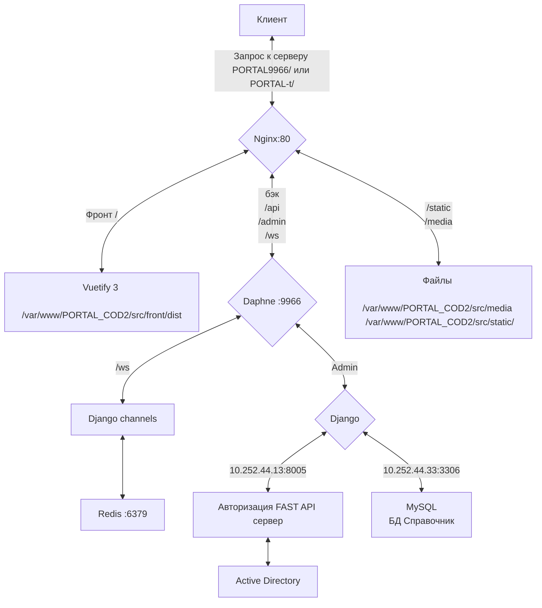

# IS#26 Портал ЦОД-2

[Общие работы по проекту](/COD2/PORTAL_COD2/projects/22)


Prod Portal9966/ (10.252.44.28)
Test Potal-t/ (10.252.44.60)

## Стэк ##
1. Python 3.10
2. Vuetify3
3. MySQL
4. Redis

## Особенности веток ##
У разработчиков у каждого своя ветка.

npm version patch производится на ветке razrab

окончательная сборка - на main
## Схема ##




## Установка и настройка ##

### Первоначальная установка после клонирования в папку. В случае неисправностей, идти примерно по этому же пути ###

Инициализация проекта:

- Инициализировать git
- Выполнить git clone

1. В каталоге проекта Создаем окружение

``` python3.10 -m venv env ```

2. Активируем окружение

``` source env/bin/activate```

3. устанавливаем необходимые пакеты

``` cd sys ```
```pip install -r r.txt --proxy= http://...```

Если нет proxy:

На машине разработки выполнить команду ```pip download -r ../r.txt```

Команда для установки python 
```pip install --no-index --find-links /Путь_К_Папке_С_Пакетами/ -r r.txt```

Запушить изменения в ветку 

Синхронизировать ветку на сервере

``` git pull ```

Если произошла ошибка: ``` git reset --hard ```

4. переходим в каталог src 

``` cd ../src/```

5. В каталог src разархивируем portal.zip из sys  
    Прописываем подключения в settings.py
    

6. Для проверки запускаем сервер разработки

```python manage.py runserver```

Если в консоли не появляются ошибки и сервер стартует, переходим далее. В противном случае - доустанавливаем необходимые пакеты.

 7. останавливаем сервер разработки (CTRL+C)

На этом работы непосредственно с бэкэндом завершены
### Порты ###
  Daphne: 9966

###  Настройка NGINX, GUNICORN, Vuetify, Daphne ###
 В каталоге sys расположены примерные файлы конфигов для тестового и боевого серверов
 
 Тестовый сервер: /sys/test_server

При копировании убедиться, что пути соответствуют системе
 #### NGINX Vuetify ####
 Стандартный путь для файлов .conf 
 /etc/nginx/sites-enabled


#### Daphne ####
Файлы .service кладем в каталог /etc/systemd/system

Проверяем путь виртуального окружения и порт в файле на соответствие с конфигурацией Nginx

#### Запуск сервера ####
Запускаем Daphne ``` Start portaldaphne ```
Перезагружаем Nginx ``` Restart nginx ```