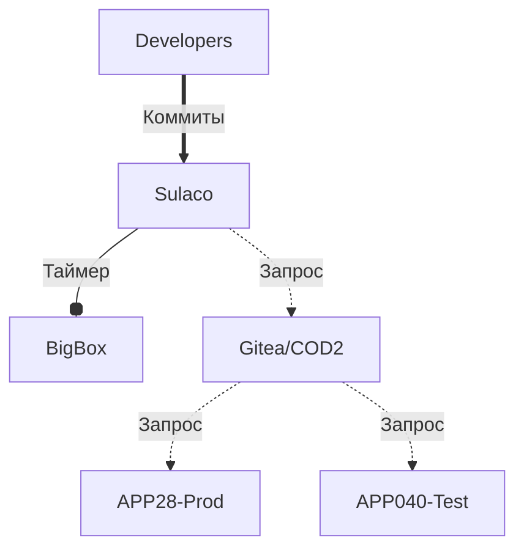

# Резервное копирование

# Резервное копирование исходных текстов
Копирование как таковое не осуществляется. Резервирование основано на вытягивании (PULL) репозитория по протоколу Git в место резервного хранения.

Дата последней проверки работы: 2023-12-18

## Схема размещения репозиториев

* Коммит - по мере выкатки в репозиторий очередных правок
* Таймер - по заданному расписанию (как правило - раз в сутки)
* Запрос - ручной запрос на проведение синхронизации

Учетки для резервного копирования
  * R2D2 - для вытягивания в ЦОД2
  * BigBoy - для вытягивания в BigBox